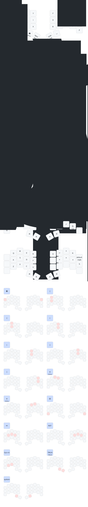

 

# Regret Keyboard ZMK Configuration

ZMK firmware configuration for the Regret keyboard with platform-specific keymaps optimized for productivity and ergonomics.

## Features

- **Platform-Specific Layouts**: Separate Mac and Windows configurations
- **34-Key Split Layout**: Optimized for Dvorak-based typing
- **Home Row Mods**: Comfortable modifier access without leaving home row
- **Multiple Layers**: Default, Symbol, Navigation, Number, System, Tmux, and Game layers
- **Visual Feedback**: RGB lighting changes with layer activation
- **Smart Combos**: Bracket pairs, shift keys, and system layer access

## Layer Overview

| Layer | Purpose | Access |
|-------|---------|--------|
| **Default** | Base typing layer (Dvorak layout) | Default |
| **Symbol** | Symbols, special characters | Hold right inner thumb |
| **Navigation** | Arrow keys, shortcuts, modifiers | Hold left inner thumb |
| **Number** | Numbers, function keys | Hold both inner thumbs |
| **System** | Bluetooth, RGB, media controls | Press both outer thumbs |
| **Tmux** | Tmux window/pane management | `to TMUX_L` from Symbol layer |
| **Game** | QWERTY gaming layout | Toggle from System layer |

## Tmux Layer - Detailed Guide

### Overview

The Tmux layer provides one-tap access to all common tmux operations, eliminating the need to manually type the prefix key. It's optimized for ergonomics with the most frequent operations on the home row.

### Activation

From the **Symbol layer** (hold right inner thumb), press the **top-right key** (position 8) to enter the Tmux layer. The keyboard will change to **cyan** color to indicate you're in Tmux mode.

### Layout

```
┌─────────────────── TMUX LAYER ───────────────────┐
│ Window Numbers (Top Row - Most Frequent)         │
│  1    2    3    4    5  │  6    7    8    9    0  │
│                                                    │
│ Pane Operations (Home Row - Ergonomic)           │
│ copy vsp  hsp   h    j  │  k    l   zoom  X   new │
│                                                    │
│ Session/Window Management (Bottom Row)            │
│ next prev det resize lay│ sess  win  name EXIT brk│
└────────────────────────────────────────────────────┘
```

### Key Reference

#### Top Row - Window Switching
| Key | Function | Tmux Command |
|-----|----------|--------------|
| `1-9, 0` | Switch to window N | `prefix + N` |

#### Home Row - Pane Operations (Most Frequent)
| Key | Function | Tmux Command | Notes |
|-----|----------|--------------|-------|
| **Left Hand** |
| `copy` | Enter copy mode | `prefix + [` | Vim-style scrolling/selection |
| `vsp` | Vertical split | `prefix + %` | Creates side-by-side panes |
| `hsp` | Horizontal split | `prefix + "` | Creates stacked panes |
| `h` | Focus pane left | `prefix + h` | Vim-style navigation |
| `j` | Focus pane down | `prefix + j` | Vim-style navigation |
| **Right Hand** |
| `k` | Focus pane up | `prefix + k` | Vim-style navigation |
| `l` | Focus pane right / Last window | `prefix + l` | Dual purpose |
| `zoom` | Toggle pane zoom | `prefix + z` | Fullscreen current pane |
| `X` | Close pane | `prefix + x` | With confirmation prompt |
| `new` | New window | `prefix + c` | Uses current path |

#### Bottom Row - Window/Session Management
| Key | Function | Tmux Command | Notes |
|-----|----------|--------------|-------|
| **Left Hand** |
| `next` | Next window | `prefix + n` | Window navigation |
| `prev` | Previous window | `prefix + p` | Window navigation |
| `det` | Detach session | `prefix + d` | Backgrounds tmux |
| `resize` | Enter resize mode | `prefix + r` | Use hjkl to resize panes |
| `lay` | Cycle layouts | `prefix + Space` | Even-horizontal, even-vertical, etc. |
| **Right Hand** |
| `sess` | Choose session | `prefix + s` | Interactive session picker |
| `win` | Choose window | `prefix + w` | Interactive window picker |
| `name` | Rename window | `prefix + ,` | Edit current window name |
| `EXIT` | Return to default | - | Exit Tmux layer |
| `brk` | Break pane | `prefix + b` | Move pane to new window |

### Common Workflows

#### 1. Quick Window Switch
```
Hold SYM (right inner thumb)
→ Tap top-right key (enters TMUX layer)
→ Tap number (1-9, 0)
→ Release
```

#### 2. Split & Navigate Development Layout
```
Enter TMUX layer
→ vsp (vertical split, creates side-by-side)
→ l (move right)
→ hsp (horizontal split right pane)
→ zoom (if you want to focus on code)
```

Result: 3-pane layout perfect for code | terminal | logs

#### 3. Focus Mode (Zoom)
```
Enter TMUX layer → zoom
```
Toggles current pane to fullscreen. Press again to restore layout.

#### 4. Session Management
```
Enter TMUX layer → sess
```
Opens interactive picker to switch between projects/sessions.

#### 5. Precision Pane Resizing
```
Enter TMUX layer → resize
→ hjkl (5-unit movements)
→ HJKL (1-unit fine-tuning)
→ Escape or Enter to finish
```

### Ergonomic Benefits

1. **Home Row Optimization**: 80% of operations accessible without moving from home position
2. **Spatial Consistency**: h/j/k/l maintains vim-like directional logic
3. **Workflow Grouping**: Related operations clustered (splits near nav)
4. **One-Tap Access**: No need to type prefix manually
5. **Visual Feedback**: Cyan layer color provides clear mode indication
6. **Reduced Cognitive Load**: No need to remember prefix combinations

### Integration with Tmux Config

The layer works seamlessly with the tmux configuration at `~/.config/tmux/tmux.conf`:

- **Prefix Key**: HOME key (configurable via `TMUX_PREFIX` define)
- **Enhanced Resize Mode**: Supports both hjkl and arrow keys
- **Session Persistence**: Auto-creates session on attach
- **Path Awareness**: New windows/panes inherit current directory
- **Visual Activity**: Monitors activity in other windows

### Customization

#### Changing the Prefix Key

Edit `config/regret.keymap` line 35:
```c
#define TMUX_PREFIX HOME
```

Replace `HOME` with your preferred key (e.g., `F13`, `F24`, `CAPS`).

#### Adding Custom Tmux Commands

Add a new macro:
```c
ZMK_MACRO(tmux_custom, bindings = <&kp TMUX_PREFIX &kp YOUR_KEY>;)
```

Then add to the layer bindings in the `tmux_layer` section.

## Default Layer (Dvorak-Based)

```
'  ,  .  p  y    f  g  c  r  l
a  o  e  u  i    d  h  t  n  s
;  q  j  k  x    b  m  w  v  z
   BSPC NAV SYM SPACE
```

### Combos

- **Brackets**: Vertical combos on home/top rows
  - `o+,` = `[`, `e+.` = `{`, `u+p` = `(`
  - `g+c` = `)`, `h+r` = `}`, `t+l` = `]`
- **Shift**: `e+u` or `h+t` = sticky shift
- **Escape**: `o+e+u` (3-key combo on left home)
- **Return**: `h+t+n` (3-key combo on right home)
- **Caps Word**: `'+l` (corners)
- **Caps Lock**: `z+;` (bottom corners)
- **System Layer**: Both inner thumbs together

## Symbol Layer

Access: Hold right inner thumb (SYM)

```
-      *      -      -      ~    ^      -      EMJ   TMUX   `
-      *      =      _      $    #      MOD5   MOD6  MOD7   MOD8
+      |      @      /      %    |>     \      &     ?      !
```

- **Top Right**: Emoji picker, Tmux layer access, backtick
- **Home Row**: Math operators, modifiers
- **Bottom**: Logic/programming symbols, hackpipe (`|> `)

## Navigation Layer

Access: Hold left inner thumb (NAV)

```
-      swap   wswap  sshot  globe   TAB    HOME   UP     END    -
MOD1   MOD2   MOD3   MOD4   BSPC    DEL    LEFT   DOWN   RIGHT  -
Cmd+Z  Cmd+X  Cmd+C  Cmd+V  -       -      PGDN   -      PGUP   LOCK
```

- **Window Management**: App switcher (`swap`), window switcher (`wswap`)
- **Cursor Keys**: Vim-style arrow placement + Home/End
- **Editing**: Backspace, Delete, common shortcuts
- **Modifiers**: MOD1-4 for chording

## Number Layer

Access: Hold both inner thumbs (SYM + NAV)

```
1     2     3     4     5      6     7     8     9     0
MOD1  MOD2  MOD3  MOD4  F6     F7    MOD5  MOD6  MOD7  MOD8
F1    F2    F3    F4    F5     F8    F9    F10   F11   F12
```

- **Numbers**: Top row 1-0
- **Function Keys**: F1-F12 on bottom two rows
- **Modifiers**: Available for function key chording

## System Layer

Access: Press both outer thumbs together

```
BOOT   GAME   -      -      -       RGB    PLAY   -      -      UNSTICK
MOD1   MOD2   MOD3   MOD4   -       PREV   VOL-   VOL+   NEXT   -
-      BT0    BT1    BT2    -       BTCLR  BTX2   BTX1   BTX0   -
```

- **Firmware**: Bootloader (top-left for flashing)
- **Bluetooth**: Profile selection (BT0-2), clear, disconnect
- **Media**: Play/pause, volume, track control
- **RGB**: Toggle lighting
- **Modes**: Toggle game layer

## Game Layer

Access: Toggle from System layer

QWERTY-style layout for gaming with dedicated arrow keys and common game bindings.

## Platform Differences

### Mac (`CONFIG_SHIELD_REGRET_MAC`)
- Globe key support
- Cmd-based shortcuts
- macOS media controls

### Windows (`CONFIG_SHIELD_REGRET_WINDOWS`)
- Win key mappings
- Alt-based shortcuts
- Windows-specific media handling

## Building

```bash
# Build for specific platform
west build -p -b nice_nano_v2 -- -DSHIELD=regret_mac

# Or use build.yaml for automated builds
```

## Configuration

Key timing parameters in `config/regret.keymap`:

```c
#define HRM_TERM 280           // Hold-tap threshold (ms)
#define HRM_QUICK_TAP 175      // Quick tap prevention (ms)
#define HRM_IDLE (10500 / 50)  // Idle timeout for 50 WPM
#define STICKY_KEY_TIMEOUT 1000 // Sticky key duration (ms)
```

Adjust based on your typing speed:
- **Faster typing**: Decrease `HRM_TERM`, increase `HRM_IDLE`
- **Slower typing**: Increase `HRM_TERM`, decrease `HRM_IDLE`

## Troubleshooting

### Tmux Layer Issues

**Problem**: Tmux commands not working
- **Check**: Ensure tmux prefix is set to HOME in `~/.config/tmux/tmux.conf`
- **Fix**: Match `TMUX_PREFIX` define in keymap to tmux config

**Problem**: Wrong pane splits
- **Remember**: `vsp` = vertical split = side-by-side (like `|`)
- **Remember**: `hsp` = horizontal split = stacked (like `—`)

### General Issues

**Sticky keys stuck**: Press both shifts or use `unstick` from system layer

**Layer not activating**: Check combo timing, ensure proper thumb key hold

**RGB not changing**: Verify RGB is enabled in system layer

## Resources

- [ZMK Documentation](https://zmk.dev/)
- [Regret Keyboard](https://github.com/qmk/qmk_firmware/tree/master/keyboards/regret)
- [Tmux Documentation](https://github.com/tmux/tmux/wiki)

## License

This configuration is provided as-is for personal use.
