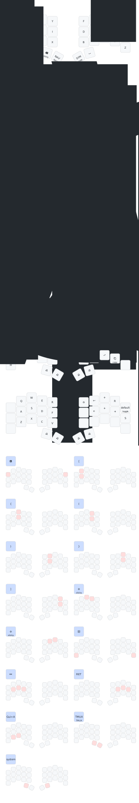

# Regret Keyboard ZMK Configuration

ZMK firmware configuration for the [Regret keyboard](https://github.com/rschenk/regret) with platform-specific keymaps optimized for productivity and ergonomics.

## Features

- **Platform-Specific Layouts**: Separate Mac and Windows configurations
- **34-Key Split Layout**: Optimized for Dvorak-based typing
- **Sticky Modifiers**: One-shot modifier access via combos and layer keys
- **Multiple Layers**: Default, Symbol, Navigation, Number, System, Tmux, and Game layers
- **Visual Feedback**: RGB lighting changes with layer activation
- **Smart Combos**: Bracket pairs, shift keys, and layer access

## Layer Overview

| Layer | Purpose | Access |
|-------|---------|--------|
| **Default** | Base typing layer (Dvorak layout) | Default |
| **Symbol** | Symbols, special characters | Hold right inner thumb |
| **Navigation** | Arrow keys, shortcuts, modifiers | Hold left inner thumb |
| **Number** | Numbers, function keys | Hold both inner thumbs (tri-layer) |
| **System** | Bluetooth, RGB, media controls | Both outer thumbs combo |
| **Tmux** | Tmux window/pane management | Both left thumbs combo, or `to TMUX_L` from Symbol layer |
| **Game** | QWERTY gaming layout | Toggle from System layer |

## Default Layer (Dvorak-Based)

```
'  ,  .  p  y    f  g  c  r  l
a  o  e  u  i    d  h  t  n  s
;  q  j  k  x    b  m  w  v  z
    BSPC NAV      SYM SPACE
```

### Combos

- **Brackets**: Vertical combos (top + home row)
  - `,+o` = `[`, `.+e` = `{`, `p+u` = `(`
  - `g+h` = `)`, `c+t` = `}`, `r+n` = `]`
- **Shift**: `.+p` or `g+c` = sticky shift
- **Escape**: `o+e+u` (3-key combo on left home)
- **Return**: `h+t+n` (3-key combo on right home)
- **Caps Word**: `'+l` (top corners)
- **Caps Lock**: `;+z` (bottom corners)
- **Select All**: `q+j` (on NAV layer only)
- **Tmux Layer**: Both left thumbs (BSPC + NAV)
- **System Layer**: Both outer thumbs (BSPC + SPACE)

## Symbol Layer

Access: Hold right inner thumb (SYM)

```
-      -      -      -      ~      ^      -      EMJ   TMUX   `
-      *      =      _      $      #      sk5    sk6   sk7    sk8
+      |      @      /      %      |>     \      &     ?      !
```

- **Top Right**: Emoji picker, Tmux layer toggle, backtick
- **Home Row Left**: Math operators (`-`, `*`, `=`, `_`, `$`)
- **Home Row Right**: `#` + sticky modifiers (Shift, Cmd, Alt, Ctrl)
- **Bottom**: Logic/programming symbols, hackpipe (`|> `)

## Navigation Layer

Access: Hold left inner thumb (NAV)

```
-      swap   wswap  sshot  globe   TAB    HOME   UP     END    -
sk1    sk2    sk3    sk4    BSPC    DEL    LEFT   DOWN   RIGHT  -
Cmd+Z  Cmd+X  Cmd+C  Cmd+V  -       -      PGDN   -      PGUP   LOCK
```

- **Window Management**: App switcher (`swap`), window switcher (`wswap`)
- **Cursor Keys**: Vim-style arrow placement + Home/End
- **Editing**: Backspace, Delete, common shortcuts
- **Sticky Modifiers**: Left hand home row (Ctrl, Alt, Cmd, Shift)

## Number Layer

Access: Hold both inner thumbs (tri-layer: SYM + NAV)

```
1     2     3     4     5      6     7     8     9     0
sk1   sk2   sk3   sk4   F6     F7    sk5   sk6   sk7   sk8
F1    F2    F3    F4    F5     F8    F9    F10   F11   F12
```

- **Numbers**: Top row 1-0
- **Function Keys**: F1-F12 on bottom two rows
- **Sticky Modifiers**: Available for function key chording

## Tmux Layer

Access: Both left thumbs combo (BSPC + NAV), or `to TMUX_L` from Symbol layer top row

The Tmux layer is organized as a 2D grid: **rows = tmux objects**, **columns = actions**. The keyboard turns **cyan** when active.

```
┌──────────────────── TMUX LAYER ────────────────────┐
│         MUTATING (left)      │  NAVIGATION (right)  │
│  create modify  kill  browse find │ prev  next  last  util  exit │
├─────── Windows (top row) ────┼──────────────────────┤
│  new    rename  kill  browse find │ prev  next  last  layout EXIT │
├─────── Panes (home row) ─────┼──────────────────────┤
│  vsplit hsplit  kill  break  swap │  -    next  last  zoom  resize│
├─────── Sessions (bottom) ────┼──────────────────────┤
│  browse detach   -     -      -  │ prev  next  last  copy   -    │
└──────────────────────────────┴──────────────────────┘
```

### Key Reference

#### Top Row - Window Management
| Position | Left Hand | | Right Hand |
|----------|-----------|--|------------|
| Col 1 | `new` — new window (`prefix+c`) | | `prev` — previous window (`prefix+p`) |
| Col 2 | `rename` — rename window (`prefix+,`) | | `next` — next window (`prefix+n`) |
| Col 3 | `kill` — kill window (`prefix+&`) | | `last` — last window (`prefix+l`) |
| Col 4 | `browse` — choose window (`prefix+w`) | | `layout` — cycle layouts (`prefix+Space`) |
| Col 5 | `find` — find window (`prefix+f`) | | `EXIT` — return to default layer |

#### Home Row - Pane Operations
| Position | Left Hand | | Right Hand |
|----------|-----------|--|------------|
| Col 1 | `vsplit` — vertical split (`prefix+%`) | | *(empty)* |
| Col 2 | `hsplit` — horizontal split (`prefix+"`) | | `next` — cycle panes (`prefix+o`) |
| Col 3 | `kill` — close pane (`prefix+x`) | | `last` — last pane (`prefix+;`) |
| Col 4 | `break` — break pane to window (`prefix+b`) | | `zoom` — toggle fullscreen (`prefix+z`) |
| Col 5 | `swap` — swap pane (`prefix+Shift+o`) | | `resize` — enter resize mode (`prefix+r`) |

#### Bottom Row - Session Management
| Position | Left Hand | | Right Hand |
|----------|-----------|--|------------|
| Col 1 | `browse` — choose session (`prefix+s`) | | `prev` — previous session (`prefix+(`) |
| Col 2 | `detach` — detach session (`prefix+d`) | | `next` — next session (`prefix+)`) |
| Col 3-5 | *(empty)* | | `last` — last session (`prefix+Shift+l`) |
| | | | `copy` — enter copy mode (`prefix+[`) |

### Common Workflows

#### Split & Navigate Development Layout
```
Enter TMUX layer
→ vsplit (vertical split, creates side-by-side)
→ next pane (prefix+o to move to new pane)
→ hsplit (horizontal split right pane)
→ zoom (if you want to focus on code)
```

Result: 3-pane layout perfect for code | terminal | logs

#### Focus Mode (Zoom)
```
Enter TMUX layer → zoom
```
Toggles current pane to fullscreen. Press again to restore layout.

#### Session Management
```
Enter TMUX layer → browse sessions
```
Opens interactive picker to switch between projects/sessions.

### Integration with Tmux Config

The layer works seamlessly with your tmux configuration:

- **Prefix Key**: HOME key (configurable via `TMUX_PREFIX` define)

#### Changing the Prefix Key

Edit `config/regret.keymap`:
```c
#define TMUX_PREFIX HOME
```

Replace `HOME` with your preferred key (e.g., `F13`, `F24`, `CAPS`).

#### Adding Custom Tmux Commands

Add a new macro:
```c
ZMK_MACRO(tmux_custom, bindings = <&kp TMUX_PREFIX &kp YOUR_KEY>;)
```

Then add to the layer bindings in the `tmux_layer` section.

## System Layer

Access: Both outer thumbs combo (BSPC + SPACE)

```
BOOT   GAME   -      -      -       RGB    PLAY   -      -      UNSTICK
MOD1   MOD2   MOD3   MOD4   -       PREV   VOL-   VOL+   NEXT   -
-      BT0    BT1    BT2    -       BTCLR  BTX2   BTX1   BTX0   -
```

- **Firmware**: Bootloader (top-left for flashing)
- **Bluetooth**: Profile selection (BT0-2), clear, disconnect
- **Media**: Play/pause, volume, track control
- **RGB**: Toggle lighting
- **Modes**: Toggle game layer

## Game Layer

Access: Toggle from System layer (top row, second key)

QWERTY-style layout for gaming with dedicated arrow keys on right hand. Press top-right key to return to default layer.

## Platform Differences

### Mac (`CONFIG_SHIELD_REGRET_MAC`)
- Globe key support
- Cmd-based shortcuts (Cmd+Z/X/C/V)
- macOS screenshot (Ctrl+Cmd+Shift+4)
- macOS emoji picker (Ctrl+Cmd+Space)
- Screen lock (Ctrl+Cmd+Q)
- MOD1-4: Ctrl, Alt, Cmd, Shift

### Windows (`CONFIG_SHIELD_REGRET_WINDOWS`)
- Ctrl-based shortcuts (Ctrl+Z/X/C/V)
- Windows screenshot (Win+Shift+S)
- Windows emoji picker (Win+.)
- Screen lock (Win+L)
- MOD1-4: Win, Alt, Ctrl, Shift

## Building

Builds are automated via GitHub Actions on tag push. To build locally:

```bash
west build -p -b seeeduino_xiao_ble -- -DSHIELD=regret -DCONFIG_SHIELD_REGRET_MAC=y
```

## Configuration

Key timing parameters in `config/regret.keymap`:

```c
#define HRM_TERM 280           // Hold-tap threshold (ms)
#define HRM_QUICK_TAP 175      // Quick tap prevention (ms)
#define HRM_IDLE (10500 / 50)  // Idle timeout for 50 WPM
#define STICKY_KEY_TIMEOUT 1000 // Sticky key duration (ms)
```

Adjust based on your typing speed:
- **Faster typing**: Decrease `HRM_TERM`, increase `HRM_IDLE`
- **Slower typing**: Increase `HRM_TERM`, decrease `HRM_IDLE`

## Troubleshooting

**Tmux commands not working**: Ensure tmux prefix is set to HOME in your tmux config. Match `TMUX_PREFIX` define in keymap.

**Sticky keys stuck**: Use `unstick` from system layer (top-right), which taps all modifier keys to clear them.

**Layer not activating**: Check combo timing, ensure proper thumb key hold.

## Resources

- [ZMK Documentation](https://zmk.dev/)
- [Regret Keyboard](https://github.com/rschenk/regret)
- [Tmux Documentation](https://github.com/tmux/tmux/wiki)
